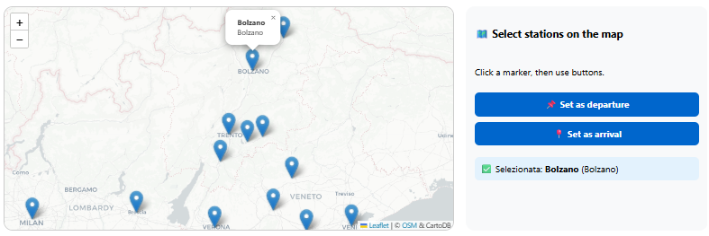
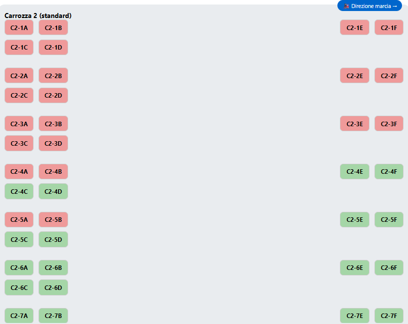
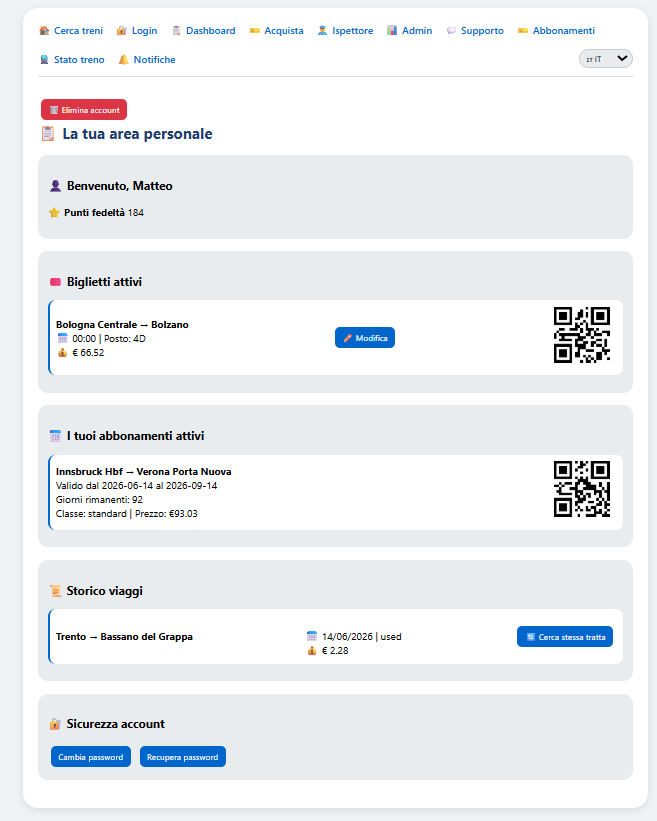
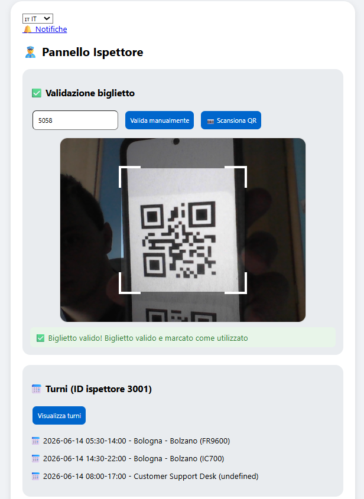
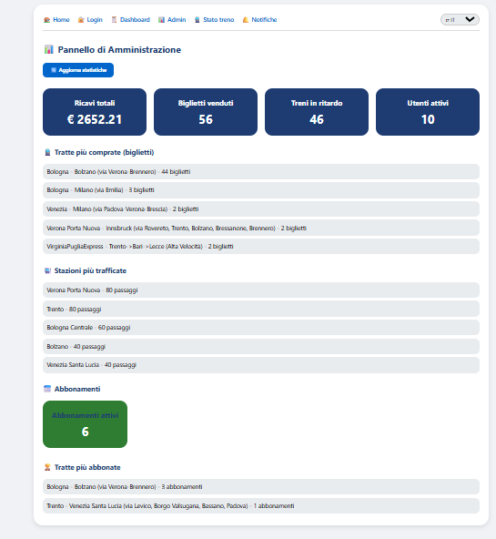
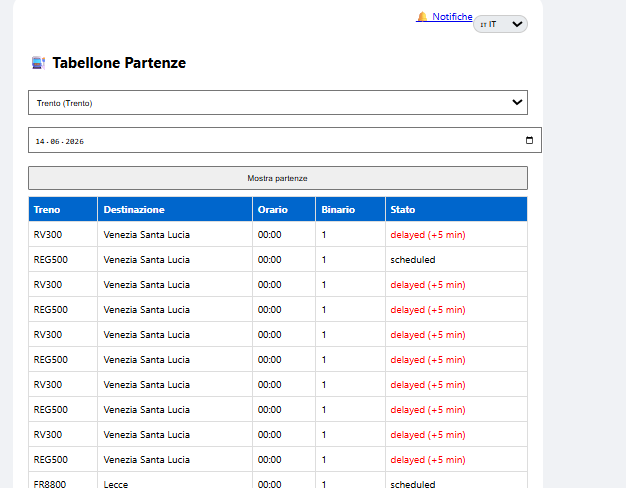
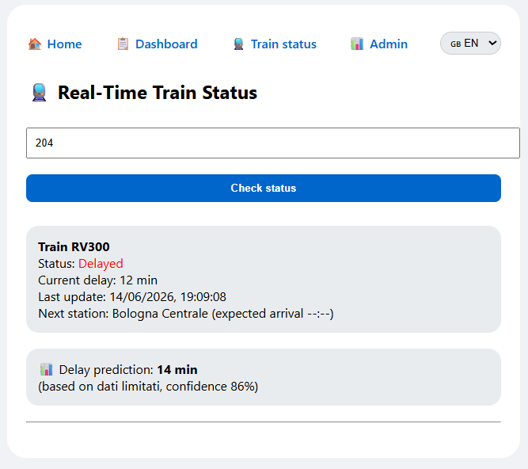

#  Train Web Application – 104 Team Not Found


A full‑stack web application for train ticket and subscription management, built as a university project for the Software Engineering course.  
The system supports passengers, ticket inspectors, and administrators with real‑time train information, delay predictions, loyalty points, and secure role‑based access.

---

##  Table of Contents

- [Overview](#overview)
- [Main Features](#main-features)
- [Technologies Used](#technologies-used)
- [Project Structure](#project-structure)
- [Installation & Setup](#installation--setup)
- [How to Run from VSCode](#how-to-run-from-vscode)
- [Default Credentials](#default-credentials)
- [API Documentation (Selected Endpoints)](#api-documentation-selected-endpoints)
- [Screenshots](#screenshots)
- [Team](#team)
- [License](#license)

---

## Overview

The **Train Web Application** modernises the ticket purchase and travel management experience.  
It consolidates:

- Journey planning with intelligent search and delay predictions.
- Ticket and subscription purchases (with seat selection and extra services).
- Loyalty points system.
- Real‑time train status and station departure boards.
- Dedicated interfaces for ticket inspectors (validation, shift schedules) and administrators (sales statistics, delay simulation).

The project follows the specifications defined in three deliverables (D1: Requirements, D2: Design, D3: Implementation & Testing) and is fully compliant with the UML class diagram and use case models.

---

## Main Features

###  For Passengers (Registered Users)

-  Search trains by departure/arrival, date, class, and optional filters (price, duration, delay probability).
-  Select stations on an interactive map (Leaflet integration).
-  Choose specific seats via a visual seat map.
-  Buy tickets or monthly subscriptions (with automatic discount if an active subscription covers the same route).
-  Add extra services: bike spaces, luggage storage.
-  Earn loyalty points (1 point per € spent) and use them for discounts.
-  View active tickets/subscriptions, booking history, and remaining subscription days.
-  Modify tickets (date/time) up to 24h before departure.
-  Receive real‑time notifications (delays, purchase confirmations, security alerts).
-  Contact customer support.
-  Manage account: change password, recover password, delete account (GDPR compliant).

###  For Ticket Inspectors

-  Scan QR codes (or manually enter IDs) to validate tickets and subscriptions.
-  Distinguish between active tickets (marked used) and active subscriptions (remain valid until expiry date).
-  View personal shift schedule with assigned routes and train codes.
-  Update train occupancy during validation (simulated).

###  For Administrators

-  Dashboard with key metrics: total revenue, bookings, delayed trains, active users.
-  Top purchased routes and busiest stations (tickets + subscriptions).
-  Number of active subscriptions and most subscribed routes.
-  Simulate train delays – automatically notifies affected passengers (in‑app + simulated email).

###  For All Users

-  Multi‑language support (Italian, English, German).
-  Real‑time departure/arrival boards for any station.
-  Track live train status (position, delay) by entering the run ID.
-  Delay prediction based on historical data (simulated ML model).

---

## Technologies Used

### Backend

- **Node.js** + **Express** (REST API)
- **File‑based database** (JSON) – simple, portable, and meeting all project requirements.
- **JWT‑like session tokens** (in‑memory sessions for demonstration).

### Frontend

- **HTML5 / CSS3** (responsive design)
- **JavaScript (ES6)**
- **Leaflet** – interactive station map
- **QRCode.js** – generate QR codes for tickets/subscriptions
- **html5‑qrcode** – scan QR codes via device camera (inspector)

### Development & Documentation

- **JSDoc** – inline code documentation
- **UML** – class diagrams, use case specifications (Deliverable 2)

---

## Project Structure
JS Version/
- app.js # Main entry point (routing)
- public/ # Static frontend files
	- index.html # Search & map
	- login.html
	-  register.html
	-  dashboard.html
	-  purchase.html
	-  subscription.html
	-  inspector.html
	-  admin.html
	-  train-status.html
	-  tabellone.html
	-  notifications.html
	-  support.html
├── src/
-  database/
   - db.js # JSON database read/write & seeding
-  controllers/ # All business logic (Auth, Search, Purchase, etc.)
-  models/ # Classes matching D2 class diagram (User, Ticket, Subscription, …)
-  utils/ # Crypto, geolocation, notifications
- enums/ # Constants (AccountStatus, TravelClass, …)
- package.json


---

## Installation & Setup

### Prerequisites

- [Node.js](https://nodejs.org/) (v16 or higher)
- npm (comes with Node.js)
- Git (optional)

### Steps

1. **Clone the repository** (or download the source code):
   ```bash
   git clone https://github.com/your-repo/train-webapp.git
   cd train-webapp/JS\ Version
2. **Install dependencies** (only express is needed for production):
    ```bash
     npm install\ Version
3. **Start the server**:
    ```bash
    node app.js
4. **Open your browser** at http://localhost:3000


### How to Run from VSCode
1. Open the project folder in Visual Studio Code.
2. Open the integrated terminal (Ctrl + Shift + `).
3. Make sure you are in the JS Version directory (the one containing app.js).
4. Run:
    ```bash
    node app.js
5.You will see:
    ```bash
     Server running on http://localhost:3000
### Default Credentials
Role	Email	Password
Administrator	matteo.golinelli@studenti.unitn.it	password
Ticket Inspector	robin.bertolini@studenti.unitn.it	password
Registered User	virginia.ancora@studenti.unitn.it	password
You can also register new users directly from the registration page.
## API Documentation (Selected Endpoints)


Method	Endpoint	Description	Access
POST	/api/login	User login, returns token	Public
POST	/api/register	Create a new passenger account	Public
POST	/api/search	Direct train search	Public
POST	/api/search-advanced	Search with one change (transfer)	Public
GET	/api/train-status/:runId	Real‑time delay and next station	Public
GET	/api/departures/:stationId	Departure board	Public
POST	/api/purchase	Purchase tickets (supports discount)	Registered
POST	/api/subscription	Purchase monthly subscription (€0)	Registered
GET	/api/user/dashboard/:userId	Active tickets, history, subscriptions	Registered
POST	/api/validate	Validate ticket or subscription	Inspector
GET	/api/inspector/schedule/:id	Inspector shift schedule	Inspector
GET	/api/admin/stats	Sales & subscription statistics	Admin
POST	/api/simulate-delay	Simulate a delay (notifies users)	Admin
DELETE	/api/account	Permanently delete account (GDPR)	Registered

## Screenshots
1. Search with Map

2. Seat Selection

3. User Dashboard

4. Inspector Validation

5. Admin Statistics

6. Departures Board

7. Train Status

##  Project Documentation

For a complete understanding of the design and requirements behind this application, please refer to the official deliverable documents:

- [📄 Deliverable 1 – Requirements Analysis (D1)](./Deliverables/D1/D1_104TeamNotFound(7).pdf)
- [📄 Deliverable 2 – Design Document (D2)](./Deliverables/D2/D2_104TeamNotFound.pdf)
- [📄 Deliverable 3 – Implementation & Testing (D3)](./Deliverables/D3/D3_104TeamNotFound.pdf)
## Team
- Robin Bertolini (Group Leader)
- Matteo Golinelli
- Caterina Alessi
- Virginia Ancora

  
All team members contributed equally to the design, implementation, and documentation (~25% each).
## License
This project was developed for educational purposes as part of the Software Engineering course.
No commercial use is permitted without explicit permission from the authors.
# Enjoy your journey with **104 Team Not Found!** 🚆
